# Report-File System
Author: Shao Jiaqi  
StudentID: 119010256

## Introduction
### Environment
I use the environment provided by CSC4005.
  ```
  Operating System: CentOS Linux 7 (Core)
  ```
  ```
  $ g++ --version
  g++ (GCC) 4.8.5 20150623 (Red Hat 4.8.5-28)
  Copyright © 2015 Free Software Foundation, Inc.

  $ cmake --version
  cmake **version** 3.21.2
  ```


  CUDA & GPU Device
  ```
  Device 0: "NVIDIA GeForce RTX 2080 Ti"
  deviceQuery, CUDA Driver = CUDART, CUDA Driver Version = 11.4, CUDA Runtime Version = 11.4, NumDevs = 1
  ```
### Background

The File system is a method and data structure that the operating system uses to control how data is stored and retrieved. By separating the data into pieces and giving each piece a name, the data is easily isolated and identified. Taking its name from the way paper-based data management system is named, each group of data is called a "file." The structure and logic rules used to manage the groups of data and their names is called a "file system".

The File System is organized into layers: application programs->logical file system->file-organization module->base file system->I/O control->device. The application programs provide users with APIs to use system calls.The file organization module translates logical block to physical block, and manages free space and disk allocation.   
In this project, I have implemented the functions of some APIs with structures: Volume Control Block--contains total # of blocks, # of free blocks... File Control Block--file size, time, filename...The structures are organized on GPU:   
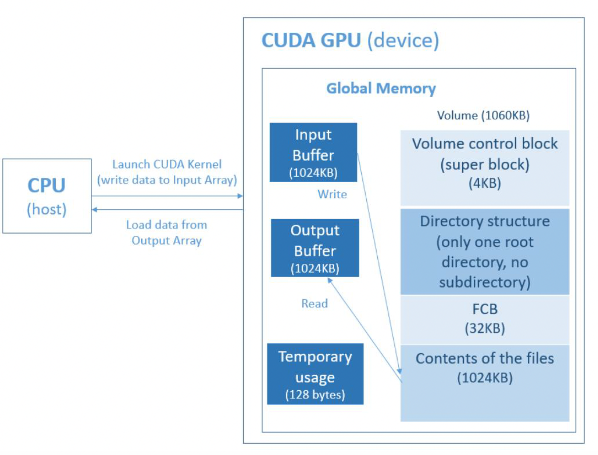 


The file system is simulated with only one directory (no subdirectory), and with multiple subdirectories (the max depth is 3) by a tree structure on GPU.

## Design Method
### File System Structure
1. Super Block
   ```cpp
   struct SuperBlock
    {
        int free_block_count; // how many free block
        u16 free_block_start; // the first start free block number;
        int total_file = 0;   // how many files in the storge
    };
   ```
2. File Control Block  
   
   ```cpp
   #pragma pack(1)
    struct FCB
    {
        u32 modified_time; // 4 bytes
        u32 create_time;   // 4 bytes
        u16 file_size;     // 2 bytes
        u16 start_block;
        char filename[20];
    };
    #pragma pack()
   ```
Declaration in the File System: 
```cpp
    SuperBlock *superBlock_ptr;
    struct FCB *FCB_arr;
    uchar *fileContent_ptr;
```

Directory structure (**Bonus**)  
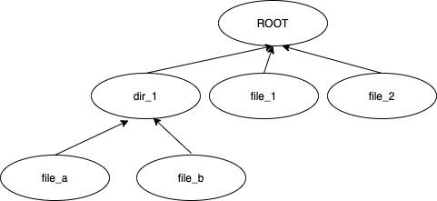


### API
**fs_open(fs, name, G_READ/G_WRITE)**  

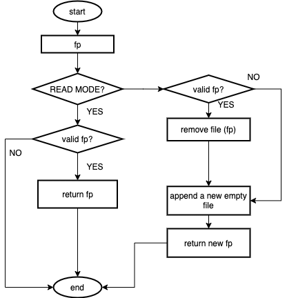


**fs_write(fs, input, size, fp)**
```cpp
    for (u32 i = start_addr; i < start_addr + size; i++)
    {
        fs->fileContent_ptr[i] = input[i - start_addr];
    } // write to File Content from input buffer.

    // update FCB_arr
    fs->FCB_arr[fp].file_size = size;
    fs->FCB_arr[fp].modified_time = gtime++;

    // update superBlock_ptr
    int delta_block = block_needs - origin_blocks;
    fs->superBlock_ptr->free_block_count -= delta_block;
    fs->superBlock_ptr->free_block_start += delta_block;
```

**fs_read(fs, output, size, fp)**  
* fp => get `start_block` and `file_size` 
* Get physical start address and end address
* Read from File Content, and put result to `output` buffer.

**fs_gsys(fs,RM, name)**

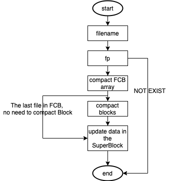

**fs_gsys (LS_D / LS_S)**

   * Use Bubble Sort 
   * LS_D:LS_D list all files name in the directory and order by modified time of files, least modified, first print. 
   * LS_S: list all files name and size in the directory and order by descending size. If there are several files with the same size, then first create first print. 
  
--------Bonus----------

**fs_open(fs, name, G_READ/G_WRITE)**  
* update: when create a new file, modify the current directory's `file_size` and `modified_time`;
* update: when remove a file, modify the current directory's `file_size`;


**fs_gsys(fs, MKDIR, name)**
* Similar with create an empty file in `fs_open`

**fs_gsys(fs,CD,name)**
```cpp
fp = linear search to get FCD index by name;
fs->curr_dir = fp; // update the current directory;
```

**fs_gsys(fs,CD_P)**
```cpp
// change to the parent directory of the current directory;
fs->curr_dir = fs->FCB_arr[fs->curr_dir].parent;
```

**fs_gsys(fs,RM_RF,name)**
```cpp
// recursive_remove_dir(fs, fp);
if (directory fp is empty) remove the empty directory fp;
for (i in range of total files number) {
    if file i is a file {
        remove file i;
    } else if (file i is a directory) {
        recursive_remove_dir(fs, i);
    }
}
remove empty directory fp;
```

**fs_gsys(fs, PWD)**  
   * Back track the parent directory until reach to the root directory. Print out the current path.
  
**fs_gsy(fs, LS_D\LS_S)**
   * update: list the files as well as directories. For a file, list it name (with size) only. For a directory, add an symbol ‘d’ at the end.
  
##  Execution
```
.
├── bonus
├── source
└── Report_119010256.pdf
```

```sh
# under the source folder or the bonus folder ...
mkdir build && cd build 
cmake .. 
cp ../data.bin ./
make -j4

# under the build folder
./cuda (or ./as4_bonus)
```
## Result
**1. TEST1**
   
|   | |
|---|---|
|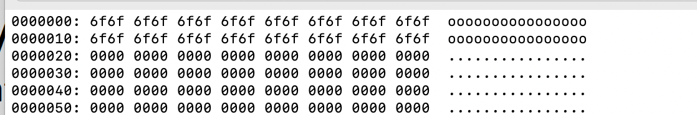|  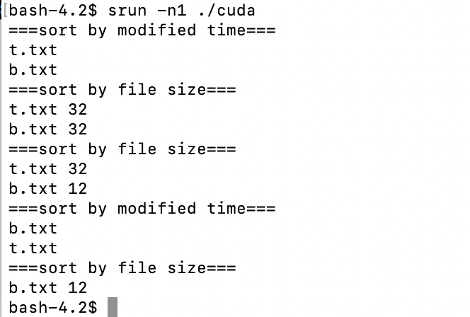|
|<Fig.3.1 TEST1's snapshot>|<Fig.3.2 TEST1's output>|
| | |

**2. TEST2**
   
|   |  |
|---|---|
|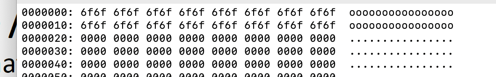|  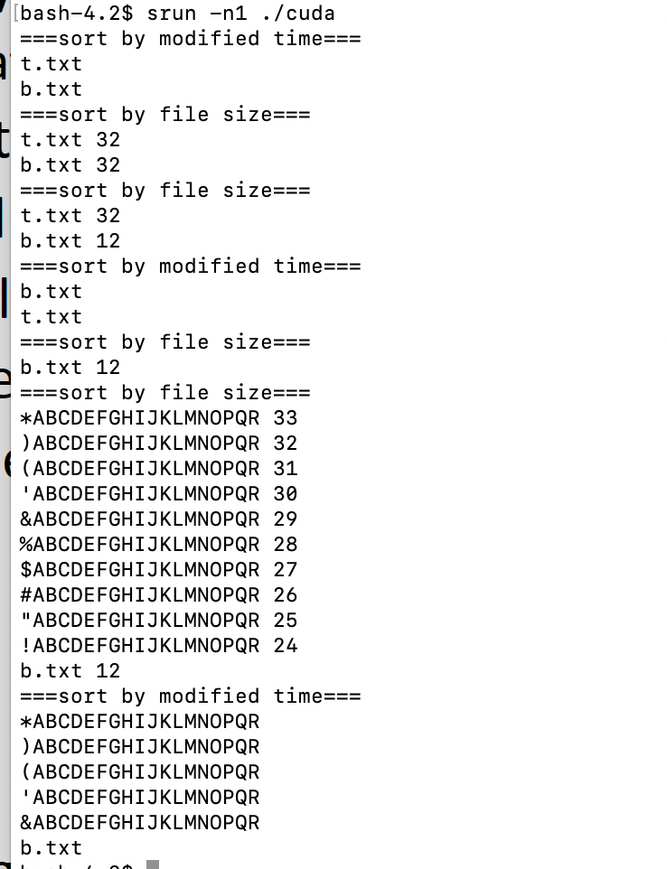|
|<Fig.3.3 TEST2's snapshot>|<Fig.3.4 TEST2's output>|
| | |

**3. TEST3**
   
|   |  |
|---|----|
||  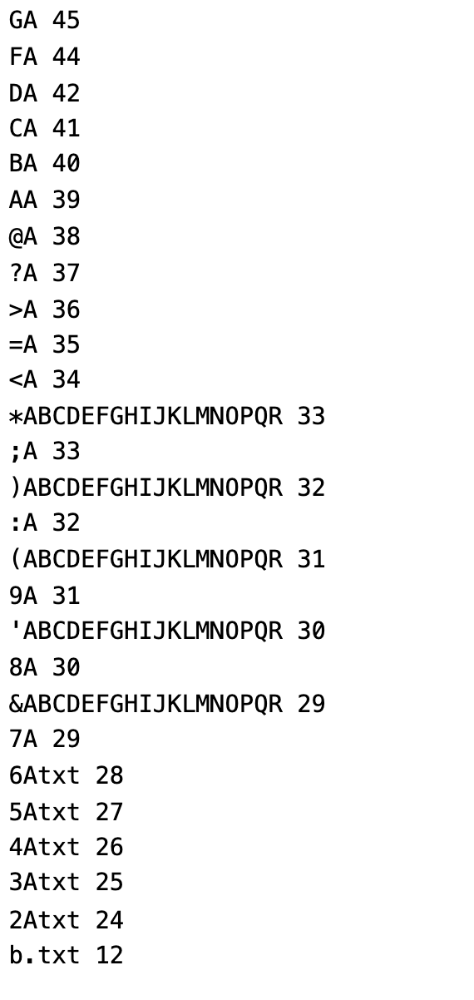|
|<Fig.3.5 TEST3's snapshot>|<Fig.3.6 TEST3's output>|
| | |

**4. BONUS TEST**

|   | |
|---|---|
|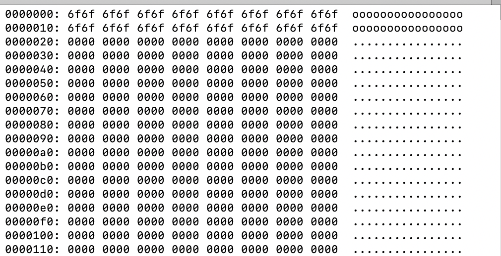|  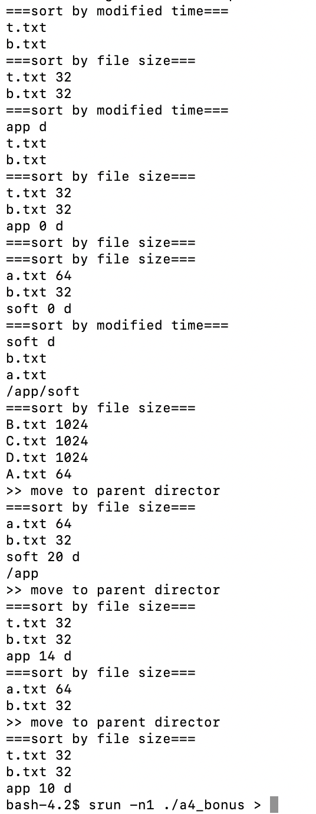|
|<Fig.3.7 BONUS TEST's snapshot>|<Fig.3.8 BONUS TEST3's output>|
| | |
## Problem Encountered
Q: How to handle the external fragment?  
A: Compaction. When remove a file, compact the BLOCK, and compact FCB.
## Conclusion
In this project, I have implemented the file system under only one directory and multiple directories. By implementing the functions, I have a better understanding of how the file system works, and how to design the data structure and logical methods. 